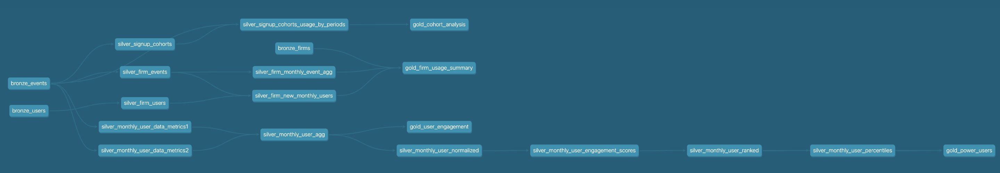

Hello!

Here's my submission for this assessment.

data modeling (dbt)

Here's a view of my data model. I decided to go with a medallion architecture (bronze/silver/gold) in order fit the use case better than a dimensional data model.

1. Assumptions:
  i. I assumed that the datasets that were provided were going to be my raw datasets so I have them as my bronze datasets in which I don't make much changes to them.
  ii. I looked over the following video to get a better understanding of the num docs field and why vault was more than the other event types: https://www.harvey.ai/platform/vault
2. Interpretation:
<n>i. gold_user_engagement:</n>
   
          Fields Used:
          sessions
          num_event_types
          total_docs
          types: I did a group concat for the types field because I wanted to get a field to show if the user may have used all events. 
          avg_docs_per_session
          last_day
          avg_feedback_score
          pct_good_feedback
          active_days: made a change to more than 1 doc in the same day then they can be considered active. Distribution looked to be close to 1.
          avg_docs_per_active_day
   ii. gold_firm_usage_summary:  I decided to break down by month because if we look at overall then some firms will always tend to look like they have a lot of activity because of the number of         users they have on the platform.  

          Fields Used:
          FIRM_SIZE
          ARR_IN_THOUSANDS
          active_users
          events
          total_docs
          avg_docs_per_event
          avg_feedback_score
          workflow: I wanted to break down the event types into their own columns because if we wanted to give a threshold on specific events then we can easily do so with this view
          vault
          assistant
          avg_docs_per_user: I kept arr in thousands and so that will mean you have to multiple the other arr fields by 1000 to get the actual number.
          arr_per_doc
          arr_per_active_user
   iii. gold_cohort_analysis: I decided to go with cohort because it helps with understanding retention overtime, enagement overtime and great for a/b experimentation and campaign impact.

          Fields Used:
          activity_month: current activity of the user within the month
          active_users: number of active users which I elected to just be number of distinct users
          avg_events_per_user: average number of events use has been in the month
          avg_docs_per_user: average number of docs user used per event in the month (may be skewed if they used only one)
   

4. Materializations: Not every table was materialized to a table output. I used three materializations (table, views, ephemeral). For ephemeral tables, I mainly did this because they were mainly in my silver (transformation layer) and a lot of the scripts I was using were calculations for a view or table. It also helped me with storage. I decided to have the bronze layer in which all of the raw data is at as views because we aren't really using these tables. For my gold tables, those are all materialized as tables since we want our end users to be able to query from them and use them in dashboards frequently. 
